<p align="right">
  <a href="./README.md">English</a> | <a href="./README.zh-CN.md">中文</a>
</p>

<h1 align="center">
  
  LibraryAdmin
</h1>

<p align="center">
  <strong>A modern library management system built with Vue 3 + Element Plus</strong>
</p>

<p align="center">
  
  
  
  
  
</p>

<p align="center">
  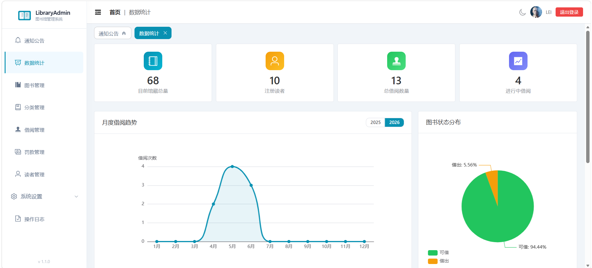
</p>

---

## Features

### Core Modules

| Module | Description |
|--------|-------------|
| **Announcements** | Publish and manage library notices with priority levels (urgent/important/normal), search & batch delete |
| **Dashboard** | Visual statistics dashboard with key metrics, pie/line charts, top books & readers |
| **Book Management** | Full CRUD operations, status tracking (available/borrowed), search & batch operations |
| **Category Management** | Tree-structured category table with expand/collapse, parent-child hierarchy |
| **Borrowing Management** | Book checkout & return, date validation, overdue highlighting, pagination |
| **Fine Management** | Overdue fine tracking with stats cards, batch payment, paid/unpaid filtering |
| **Reader Management** | Full CRUD, batch import (CSV/JSON), batch delete, borrowing history with stats |
| **Operation Logs** | Complete audit trail with filters by action type, date range, and keyword search |
| **System Settings** | Library info configuration, borrowing rules, admin account management with roles |

### UX Highlights

- **Dark Mode** — Toggle between light and dark themes with smooth transitions
- **Tab Navigation** — Multi-tab page navigation with dynamic open/close, pinned home tab
- **Responsive Layout** — Adapts to desktop, tablet, and mobile with collapsible sidebar drawer
- **Undo Bar** — Soft-delete with undo support for batch operations
- **Skeleton Loading** — Table skeleton placeholders during data loading
- **Micro-interactions** — Button press scaling, dialog scale+fade animation, icon rotation, hover transitions
- **Reduced Motion** — Respects `prefers-reduced-motion` media query for accessibility

---

## Tech Stack

| Technology | Version | Description |
|-------------|---------|--------------|
| Vue | 3.5+ | Progressive JavaScript Framework |
| Vite | 8.0+ | Next-generation frontend build tool |
| Element Plus | 2.13+ | Vue 3 component library |
| Pinia | 3.0+ | Vue state management |
| Vue Router | 5.0+ | Vue routing (hash mode) |
| ECharts | 6.0+ | Data visualization charts |
| Less | 4.6+ | CSS preprocessor |

---

## Project Structure

```plaintext
library-admin/
├── .github/workflows/           # GitHub Actions CI/CD (auto-deploy to Pages)
├── .vscode/                     # VS Code editor config
├── public/                      # Static assets
├── src/
│   ├── api/
│   │   └── mock.js              # Mock API & localStorage persistence
│   ├── assets/                  # Static resource files
│   ├── components/
│   │   ├── PaginationBox.vue    # Reusable pagination component
│   │   ├── StatCard.vue         # Statistics card component
│   │   ├── TableSkeleton.vue    # Table loading skeleton
│   │   └── UndoBar.vue          # Undo notification bar
│   ├── router/
│   │   └── index.js             # Route definitions & auth guards
│   ├── stores/
│   │   ├── user.js              # User auth state
│   │   └── theme.js             # Dark/light theme state
│   ├── views/
│   │   ├── Login.vue            # Login page with gradient background
│   │   ├── 404.vue              # 404 Not Found page
│   │   ├── Layout.vue           # Main layout (header, sidebar, tabs)
│   │   ├── AnnouncementList.vue # Announcement management
│   │   ├── Dashboard.vue        # Data statistics dashboard
│   │   ├── BookList.vue         # Book management
│   │   ├── CategoryList.vue     # Category tree management
│   │   ├── BorrowList.vue       # Borrowing management
│   │   ├── FineManagement.vue   # Fine/overdue management
│   │   ├── ReaderList.vue       # Reader management
│   │   ├── ReaderBorrowHistory.vue  # Reader borrowing history
│   │   ├── OperationLog.vue     # Operation audit log
│   │   ├── BasicSettings.vue    # System basic settings
│   │   └── AdminManagement.vue  # Admin account management
│   ├── App.vue                  # Root component (theme + page transitions)
│   ├── main.js                  # Application entry
│   └── style.css                # Global styles & CSS variables
├── index.html                   # HTML template
├── package.json                 # Dependencies
├── vite.config.js               # Vite configuration
└── README.md                    # Project documentation
```

---

## Quick Start

### Prerequisites

- [Node.js](https://nodejs.org/) >= 18

### Install Dependencies

```bash
npm install
```

### Development Server

```bash
npm run dev
# → http://localhost:3000
```

### Build for Production

```bash
npm run build
```

### Preview Production Build

```bash
npm run preview
```

---

## Login Credentials

| Field    | Value        |
|----------|--------------|
| Username | Any username |
| Password | `123456`     |

> **Note:** The system uses mock data stored in localStorage. Login only verifies that the password matches `123456`.

---

## Screenshots

### Login Page

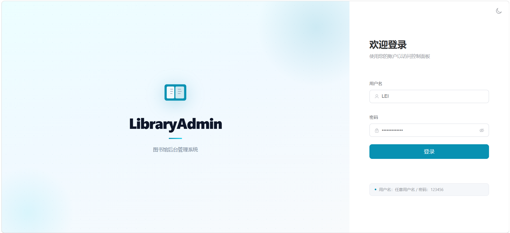

*Gradient background, centered login card with form validation and loading states*

### Announcement Management (Home)

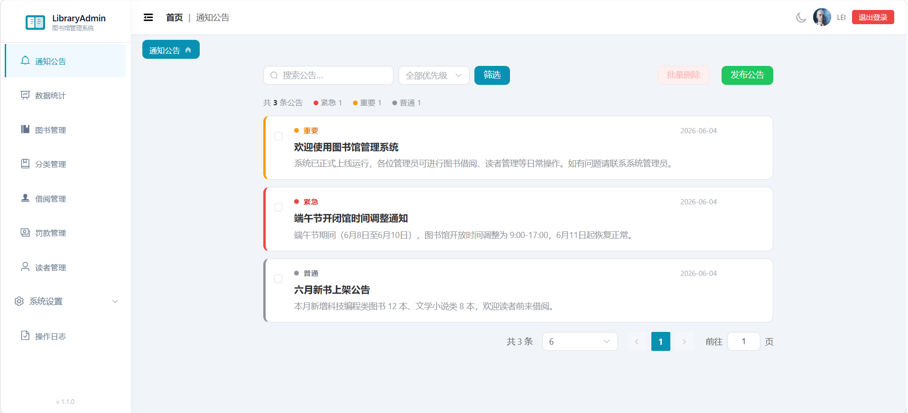

*Priority filtering, stats bar, card-based or table-based layout, batch delete with undo*

### Dashboard


*Stat cards (total books, borrowed count), book status pie chart, monthly borrowing trend line chart, top 5 popular books, top 5 active readers*

### Book Management

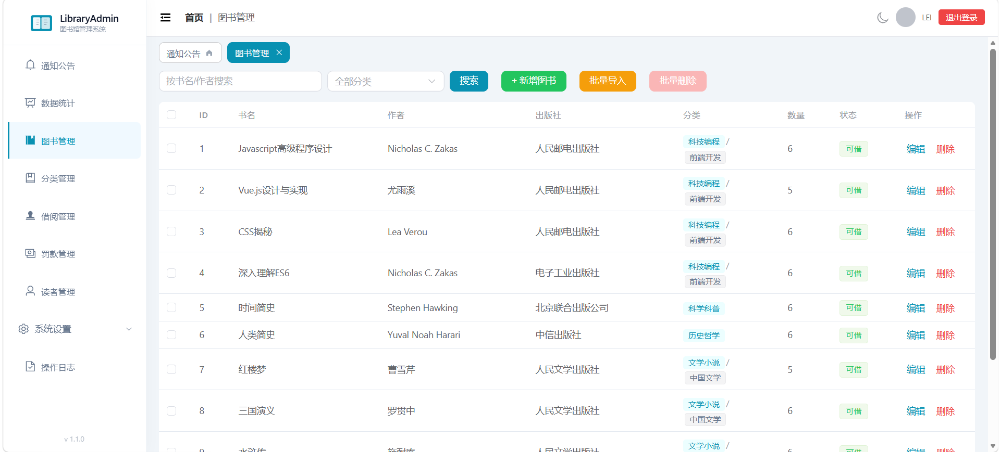

*Search & pagination, add/edit/delete with dialog forms, category tag display with parent-child labels*

### Category Management

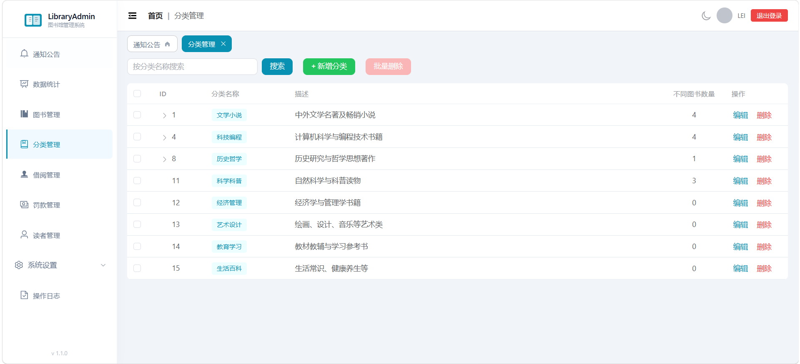

*Tree table with expand/collapse, flat search across parent & child categories, batch delete*

### Borrowing Management

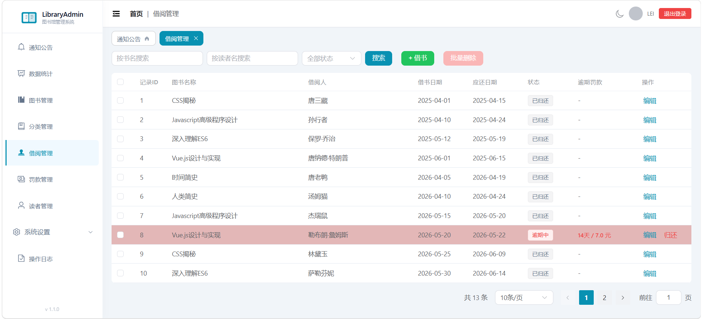

*Checkout & return workflow, date validation, overdue records highlighted in red*

### Fine Management

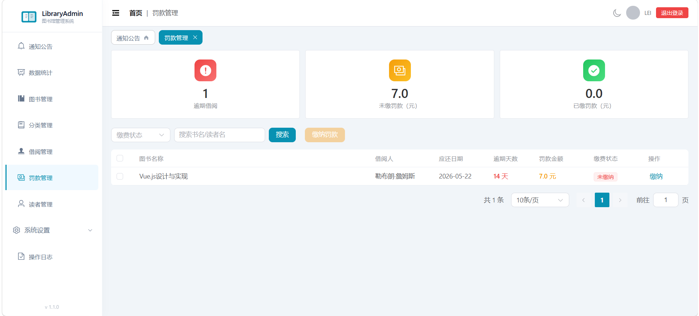

*Stats cards (overdue count, unpaid/paid amounts), batch payment, filtering by payment status*

### Reader Management

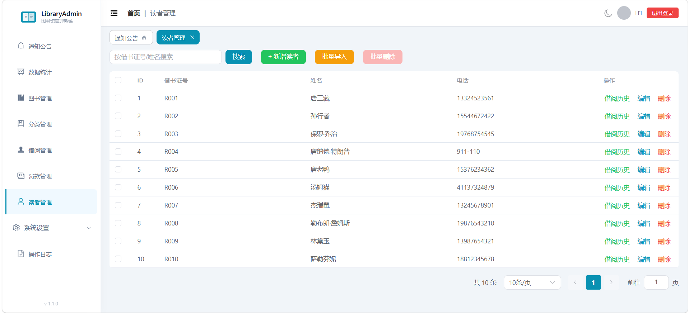

*Batch import with CSV/JSON file upload, borrowing history drill-down with stat cards*

### Operation Logs

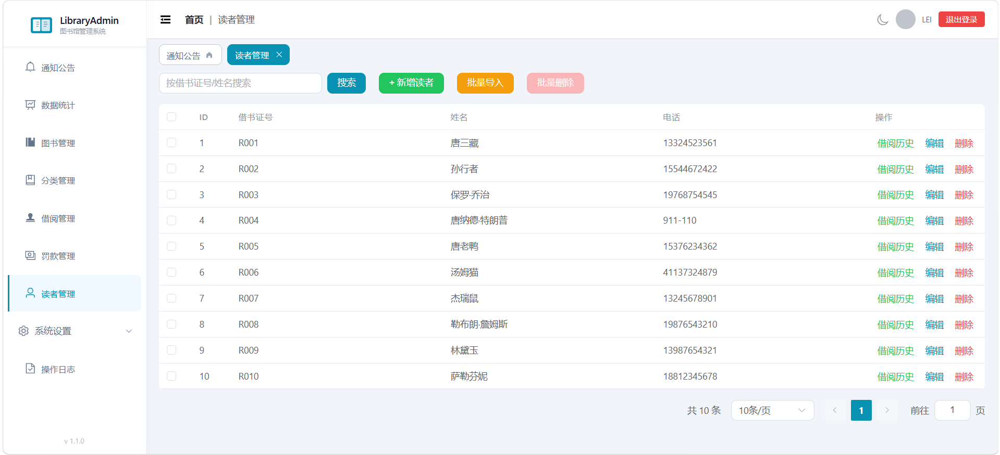

*Filter by action type & date range, paginated audit trail*

### System Settings

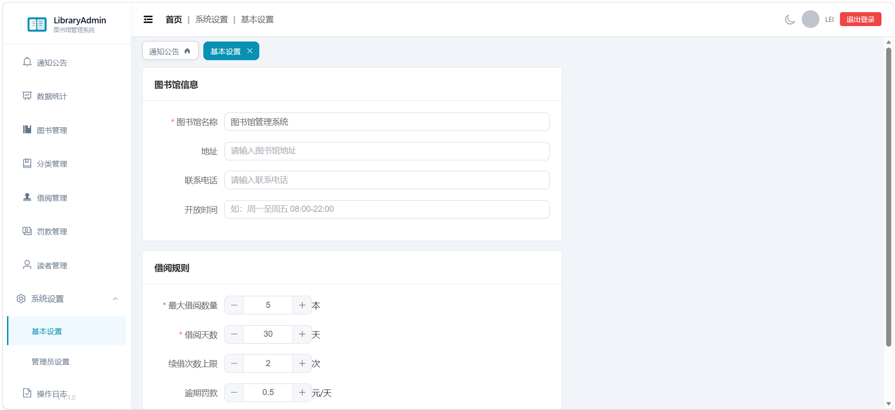

*Library info form, borrowing rules configuration, admin role management*

### Dark Mode

<p>
  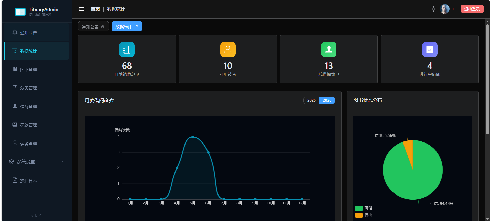
  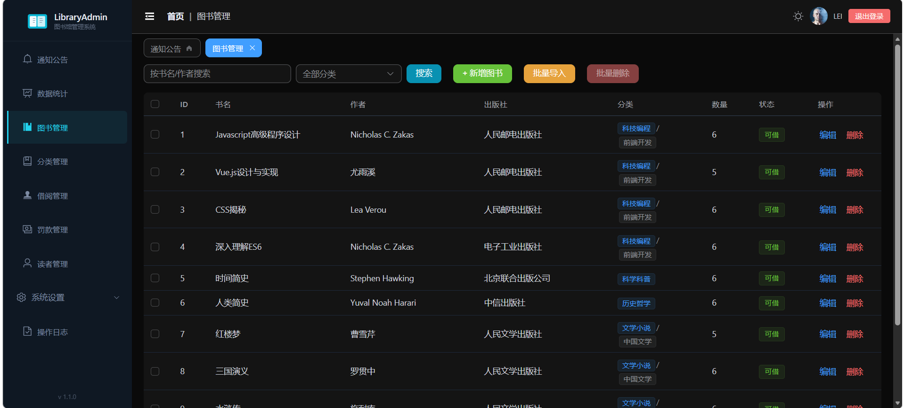
</p>

*Seamless theme switching with persistent preference stored in localStorage*

### Mobile Responsive

<p>
  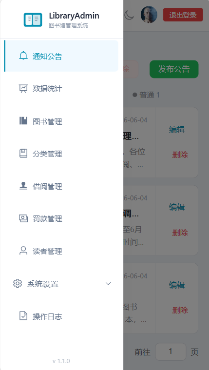
  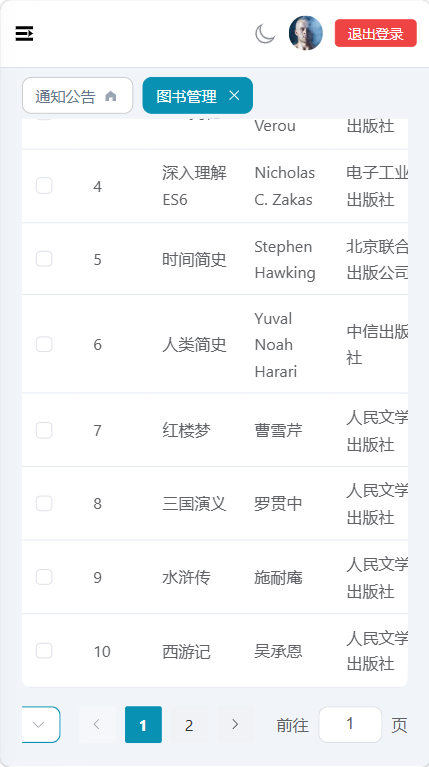
</p>

*Collapsible drawer sidebar for mobile, responsive table scrolling*

---

## Feature Checklist

- [x] User login/logout with route guards
- [x] Gradient login page with form validation
- [x] Announcement management (CRUD, priority levels, batch ops)
- [x] Book CRUD with category tags (parent + child)
- [x] Category tree management (expand/collapse, flat search)
- [x] Borrowing management (checkout / return / date validation)
- [x] Overdue borrowing highlight
- [x] Fine management with stats & batch payment
- [x] Reader CRUD operations
- [x] Reader batch delete & batch import (CSV/JSON)
- [x] Reader borrowing history with stat cards
- [x] Operation log with filtering by type / date range
- [x] System settings (library info, borrowing rules)
- [x] Admin management with role system (super/normal)
- [x] Data statistics dashboard with ECharts
- [x] Table pagination (reusable PaginationBox component)
- [x] Dark mode toggle with localStorage persistence
- [x] Dynamic multi-tab navigation with pinned home tab
- [x] Soft-delete with UndoBar notifications
- [x] Table skeleton loading placeholders
- [x] Responsive layout (desktop / tablet / mobile)
- [x] Custom theme colors (Cyan primary palette)
- [x] Sidebar version number display
- [x] 404 Not Found page
- [x] Page transition animations (fade)
- [x] Micro-interactions (button scale, icon rotation, dialog animation)
- [x] Reduced motion accessibility support
- [x] GitHub Actions auto-deploy to GitHub Pages
- [x] LocalStorage mock data persistence

---

## Deployment

The project is configured for **GitHub Pages** deployment via GitHub Actions.

### Configuration

In `vite.config.js`:

```js
export default defineConfig({
  base: '/library-admin/',  // Set to your repo name
  // ...
})
```

In `.github/workflows/deploy.yml` — triggers on push to `main` branch, builds with Vite, deploys to GitHub Pages automatically.

### Manual Deployment

```bash
npm run build
# Upload the dist/ folder to any static hosting service
```
